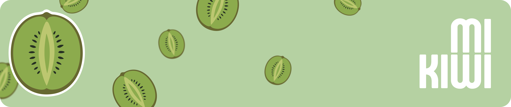
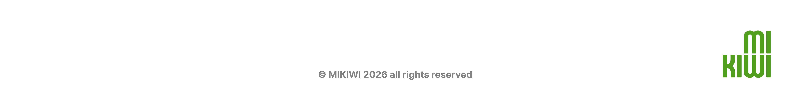

<p align="center">
  
</p>


<p align="center">
  <strong>Una experiencia e-commerce para productos personalizables, diseñada como producto real y construida con arquitectura full-stack moderna.</strong>
</p>

<p align="center">
  Laravel · React · Inertia · PostgreSQL · Stripe · Cloudinary · Three.js
</p>

<p align="center">
  <a href="docs/index.md"><strong>Ver documentación del proyecto</strong></a>
</p>
<br>

## El Proyecto


MiKiwi no es un catálogo más. Es una tienda online pensada alrededor de una idea clara: que el usuario pueda personalizar visualmente un producto antes de comprarlo.

La aplicación combina una experiencia de compra completa con un configurador interactivo, panel de administración, checkout, gestión de usuario y una arquitectura preparada para crecer.

Es un proyecto de portfolio, pero tratado como un producto real: con decisiones técnicas defendibles, estructura mantenible y foco en rendimiento.

<br><br>

<p align="center">
  
</p>

<br>

## La Experiencia

**Explorar.**  
El usuario navega por un catálogo organizado, descubre productos, revisa detalles y accede a colecciones.

**Configurar.**  
El configurador permite seleccionar piezas, variantes y previsualizar el resultado. La parte 3D se carga solo cuando hace falta para no ralentizar la navegación.

**Comprar.**  
Carrito, checkout por pasos, direcciones y pago con Stripe forman el flujo de compra.

**Gestionar.**  
El panel de administración permite mantener productos, contenido, imágenes destacadas y opciones del configurador.

---

## Lo Que Destaca

| Área | Qué demuestra |
| --- | --- |
| Producto | Una idea con propuesta de valor, no una demo aislada |
| Frontend | React modular, Inertia, CSS Modules y experiencia responsive |
| Backend | Laravel con controllers finos y lógica separada en dominio |
| Rendimiento | Carga bajo demanda para Three.js y assets pesados |
| Integraciones | Stripe para pagos y Cloudinary para media |
| Arquitectura | Separación clara entre UI, rutas, dominio y persistencia |
| Portfolio | Un proyecto explicable, enseñable y ampliable |

---

## Captura Conceptual Del Sistema

```text
Cliente
  ↓
Interfaz React + Inertia
  ↓
Laravel Controllers
  ↓
Servicios y acciones de dominio
  ↓
Modelos, base de datos e integraciones externas
```

El objetivo de esta estructura es que cada pieza tenga una responsabilidad clara: la interfaz presenta, los controladores coordinan, el dominio decide y la persistencia guarda.

---

## Stack Principal

```text
Frontend     React 18, Inertia, Vite, CSS Modules
Backend      Laravel 12, PHP 8.2+, Sanctum
Database     PostgreSQL / Supabase
Payments     Stripe
Media        Cloudinary
3D           Three.js, React Three Fiber, Drei
Quality      PHPUnit, Laravel Pint
```

---

## Por Qué Me Representa Como Desarrollador

MiKiwi refleja varias capacidades importantes en un proyecto profesional:

- convertir una idea de producto en una aplicación funcional;
- organizar un frontend grande sin perder estructura;
- diseñar backend con separación de responsabilidades;
- integrar servicios externos reales;
- cuidar rendimiento cuando hay assets pesados;
- documentar decisiones técnicas;
- pensar en mantenibilidad antes de que el proyecto crezca.

---

## Documentación Técnica

Este README es una carta de presentación. La documentación completa vive en:

- **[Índice de Documentación](docs/index.md)** (Arquitectura, Setup, Dominio)
- **[Guía para Agentes e IA](AGENTS.md)**
- **[Estructura del Proyecto](docs/PROJECT_STRUCTURE.md)**

---

## Estado

Proyecto en desarrollo activo.

MiKiwi está pensado para mostrar una base full-stack sólida, con identidad de producto y suficiente complejidad técnica como para defender decisiones reales en una entrevista, portfolio o revisión de código.


