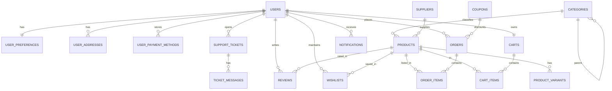

# MiKiwi - Documentación de Base de Datos

> **Versión**: 2.0 Enterprise  
> **PostgreSQL**: 16+  
> **Última actualización**: Enero 2026

---

## Índice

1. [Estructura de Archivos](#estructura-de-archivos)
2. [Diagrama ER](#diagrama-er)
3. [Tablas por Módulo](#tablas-por-módulo)
4. [Constraints e Integridad](#constraints-e-integridad)
5. [Automatización (Triggers)](#automatización-triggers)
6. [Performance](#performance)
7. [Seguridad](#seguridad)
8. [Backups](#backups)
9. [GDPR](#gdpr)
10. [Instalación](#instalación)

---

## Estructura de Archivos

```
database/
├── 01_schema.sql           # Estructura de tablas
├── 02_constraints.sql      # FKs, CHECKs, UNIQUE
├── 03_functions_triggers.sql # Automatización
├── 04_indexes.sql          # Índices de rendimiento
├── 05_materialized_views.sql # Vistas para dashboard
├── 06_security_roles.sql   # Roles y permisos
├── 07_partitions.sql       # Particionamiento (audit_logs)
├── 08_encryption.sql       # Encriptación pgcrypto
├── 09_gdpr_procedures.sql  # Cumplimiento GDPR
├── README.md               # Esta documentación
└── scripts/
    ├── docker-compose.yml  # PostgreSQL + pgAdmin + Backup
    ├── backup.sh           # Backup automático
    ├── restore.sh          # Restauración
    └── .env.example        # Variables de entorno
```

> El archivo `BBDD.sql` original está **DEPRECATED**.

---

## Diagrama ER



---

## Tablas por Módulo

### Módulo: Usuarios

| Tabla | Descripción |
|-------|-------------|
| `users` | Usuarios del sistema (customer, admin, support) |
| `user_preferences` | Preferencias (empaquetado discreto, notificaciones) |
| `user_addresses` | Direcciones de envío/facturación |
| `user_payment_methods` | Métodos de pago tokenizados |

### Módulo: Catálogo

| Tabla | Descripción |
|-------|-------------|
| `categories` | Categorías jerárquicas con slug único |
| `suppliers` | Proveedores con CIF/NIF |
| `products` | Productos con SKU único, precio, stock |
| `product_variants` | Variantes (talla, color) con stock propio |

### Módulo: Carrito

| Tabla | Descripción |
|-------|-------------|
| `carts` | Carrito único por usuario |
| `cart_items` | Items en el carrito |
| `wishlists` | Lista de deseos |

### Módulo: Pedidos

| Tabla | Descripción |
|-------|-------------|
| `coupons` | Cupones de descuento (% o fijo) |
| `orders` | Pedidos con número MK-YYYY-XXXXX |
| `order_items` | Items del pedido con snapshot de precio |

### Módulo: Reviews

| Tabla | Descripción |
|-------|-------------|
| `reviews` | Valoraciones 1-5 con verificación de compra |

### Módulo: Soporte

| Tabla | Descripción |
|-------|-------------|
| `support_tickets` | Tickets TK-XXXXX con prioridad |
| `ticket_messages` | Historial de mensajes |
| `notifications` | Notificaciones push/email |

### Módulo: Auditoría

| Tabla | Descripción |
|-------|-------------|
| `audit_logs` | Logs de cambios (particionado mensual) |
| `error_logs` | Logs de errores (particionado mensual) |
| `connection_audit_log` | Intentos de conexión |

---

## Constraints e Integridad

### Foreign Keys

| Política | Uso | Ejemplo |
|----------|-----|---------|
| `CASCADE` | Eliminar dependencias | `user_addresses` → `users` |
| `RESTRICT` | Preservar histórico | `orders` → `users` |
| `SET NULL` | Mantener registro | `audit_logs.user_id` |

### CHECK Constraints

```sql
-- Rangos numéricos
rating >= 1 AND rating <= 5
base_price >= 0
stock_quantity >= 0
quantity > 0

-- ENUMs
status IN ('pending', 'processing', 'shipped', 'delivered', 'cancelled')
payment_status IN ('pending', 'paid', 'failed', 'refunded')
role IN ('customer', 'admin', 'support')

-- Fechas coherentes
valid_from < valid_until
```

### UNIQUE

- `users.email`
- `products.sku`, `product_variants.sku`
- `orders.order_number`
- `coupons.code`
- `(user_id, product_id)` en wishlists

---

## Automatización (Triggers)

### Defensa en Profundidad

Laravel es la capa principal, los triggers son fallback de seguridad:

| Trigger | Acción |
|---------|--------|
| `update_modified_column()` | Actualiza `updated_at` |
| `generate_order_number()` | Genera MK-2026-00001 |
| `generate_ticket_number()` | Genera TK-00001 |
| `update_product_rating()` | Recalcula avg_rating |
| `reduce_stock_on_paid()` | Decrementa stock |
| `restore_stock_on_cancel()` | Restaura stock |
| `validate_stock_on_order()` | Valida stock disponible |

---

## Performance

### Vistas Materializadas

| Vista | Refresh | Uso |
|-------|---------|-----|
| `mv_admin_dashboard_stats` | 5 min | Dashboard admin |
| `mv_bestselling_products` | 1 hora | Sección bestsellers |
| `mv_monthly_sales_report` | Diario | Reportes financieros |
| `mv_category_products` | 1 hora | Listados categoría |

### Índices Clave

```sql
-- Keyset pagination (eficiente para grandes datasets)
CREATE INDEX idx_orders_keyset ON orders(created_at DESC, id DESC);

-- Full-text search español
CREATE INDEX idx_products_fts ON products 
    USING GIN (to_tsvector('spanish', name || ' ' || description));

-- Índices parciales (excluyen soft deletes)
CREATE INDEX idx_products_category ON products(category_id) 
    WHERE deleted_at IS NULL;
```

### Particionamiento

- `audit_logs` particionado por **mes**
- `error_logs` particionado por **mes**
- Retención automática configurable

---

## Seguridad

### Roles de Base de Datos

| Rol | Permisos | Uso |
|-----|----------|-----|
| `app_role` | SELECT, INSERT, UPDATE, DELETE | Backend Laravel |
| `readonly_role` | SELECT only | Analytics, BI |
| `admin_role` | ALL | Mantenimiento |

### Encriptación (pgcrypto)

**Campos encriptados:**
- `user_payment_methods.gateway_token_encrypted`
- `user_addresses.street_address_encrypted`
- `user_addresses.phone_encrypted`
- `orders.shipping_address_encrypted`

**Configuración:**
```php
// Laravel config/database.php
'options' => [
    PDO::ATTR_INIT_COMMAND => "SET app.encryption_key = '" . env('DB_ENCRYPTION_KEY') . "';"
]
```

---

## Backups

### Automatización (Docker)

| Tipo | Horario | Retención |
|------|---------|-----------|
| Diario | 02:00 AM | 7 días |
| Semanal | Domingo | 4 semanas |
| Mensual | Día 1 | 12 meses |

### Comandos

```bash
# Backup manual
docker exec mikiwi_backup /backup.sh full

# Restaurar
docker exec -it mikiwi_backup /restore.sh /backups/daily/full_20260114.dump

# Ver estadísticas
docker exec mikiwi_backup /backup.sh stats
```

---

## GDPR

### Procedimientos Disponibles

| Función | Artículo GDPR | Uso |
|---------|---------------|-----|
| `anonymize_user(uuid)` | Art. 17 | Derecho al olvido |
| `export_user_data(uuid)` | Art. 20 | Portabilidad |
| `purge_anonymized_users(days)` | - | Limpieza |
| `record_consent(...)` | Art. 7 | Consentimientos |

### Ejemplo

```sql
-- Anonimizar usuario
SELECT anonymize_user('a1b2c3d4-...');

-- Exportar datos
SELECT export_user_data('a1b2c3d4-...');

-- Reporte de cumplimiento
SELECT generate_gdpr_compliance_report();
```

---

## Instalación

### 1. Configurar Variables

```bash
cd database/scripts
cp .env.example .env
# Editar con contraseñas seguras
```

### 2. Iniciar Docker

```bash
docker-compose up -d
```

### 3. Ejecutar Scripts SQL

Los scripts se ejecutan automáticamente en orden alfabético al iniciar PostgreSQL por primera vez.

**Manual:**
```bash
docker exec -it mikiwi_postgres psql -U mikiwi_admin -d mikiwi
```

```sql
\i /docker-entrypoint-initdb.d/01_schema.sql
\i /docker-entrypoint-initdb.d/02_constraints.sql
-- ... etc
```

### 4. Accesos

| Servicio | URL | Credenciales |
|----------|-----|--------------|
| PostgreSQL | localhost:5432 | .env |
| pgAdmin | localhost:5050 | .env |

---

## Contacto

Para dudas sobre la base de datos, consultar el equipo de desarrollo.
