# MiKiwi Entity-Relationship Model

```mermaid
flowchart TB
    USER[user]
    ADDRESS[address]
    NEWSLETTER_SUBSCRIBER[newsletter_subscriber]
    PASSWORD_RESET_TOKEN[password_reset_token]
    CART[cart]
    CART_ITEM[cart_item]
    CHAT_SESSION[chat_session]
    CHAT_MESSAGE[chat_message]
    CLAIM[claim]
    CLAIM_ATTACHMENT[claim_attachment]

    CATEGORY[category]
    COLLECTION[collection]
    PRODUCT[product]
    PRODUCT_IMAGE[product_image]
    PRODUCT_IMAGE_ZONE[product_image_zone]
    DOLL_PRODUCT_ACCESSORY[doll_product_accessory]
    REVIEW[review]
    PRODUCT_FAVORITE[product_favorite]
    COLLECTION_PRODUCT[collection_product]

    ORDER[order]
    ORDER_ITEM[order_item]
    ORDER_ITEM_ACCESSORY[order_item_accessory]
    COUPON[coupon]
    PAYMENT_METHOD[payment_method]
    PAYMENT[payment]
    SHIPMENT[shipment]
    PICKUP_POINT[pickup_point]

    HOME_SECTION_IMAGE[home_section_image]
    IMAGE_HOME[image_home]
    BLOG_POST[blog_post]

    DOLL_SETTING[doll_setting]
    DOLL_PART_POSITION[doll_part_position]

    USER -->|"1 : N"| HAS_ADDRESS{tiene}
    HAS_ADDRESS --> ADDRESS

    ADDRESS -->|"1 : N"| IS_USED_FOR_SHIPPING{se usa para envío}
    IS_USED_FOR_SHIPPING --> ORDER

    ADDRESS -->|"1 : N"| IS_USED_FOR_BILLING{se usa para facturación}
    IS_USED_FOR_BILLING --> ORDER

    USER -->|"1 : 1"| HAS_CART{tiene}
    HAS_CART --> CART

    USER -->|"1 : 1"| SUBSCRIBES_TO{se suscribe a}
    SUBSCRIBES_TO --> NEWSLETTER_SUBSCRIBER

    USER -->|"1 : 0..1"| RESETS_PASSWORD_WITH{restablece contraseña con}
    RESETS_PASSWORD_WITH --> PASSWORD_RESET_TOKEN

    CART -->|"1 : N"| CONTAINS_CART_ITEM{contiene}
    CONTAINS_CART_ITEM --> CART_ITEM

    PRODUCT -->|"1 : N"| APPEARS_IN_CART{aparece en}
    APPEARS_IN_CART --> CART_ITEM

    USER -->|"1 : N"| PLACES{realiza}
    PLACES --> ORDER

    USER -->|"1 : N"| WRITES{escribe}
    WRITES --> REVIEW

    USER -->|"1 : N"| MARKS_AS_FAVORITE{marca como favorito}
    MARKS_AS_FAVORITE --> PRODUCT_FAVORITE

    USER -->|"1 : N"| OPENS{abre}
    OPENS --> CHAT_SESSION

    USER -->|"1 : N"| HAS_CLAIM{tiene}
    HAS_CLAIM --> CLAIM

    PRODUCT -->|"1 : N"| IS_RELATED_TO_CLAIM{se relaciona con}
    IS_RELATED_TO_CLAIM --> CLAIM

    CATEGORY -->|"1 : N"| CLASSIFIES{clasifica}
    CLASSIFIES --> PRODUCT

    CATEGORY -->|"1 : N"| CONTAINS_CATEGORY{contiene}
    CONTAINS_CATEGORY --> CATEGORY

    PRODUCT -->|"1 : N"| HAS_PRODUCT_IMAGE{tiene}
    HAS_PRODUCT_IMAGE --> PRODUCT_IMAGE

    PRODUCT_IMAGE -->|"1 : N"| HAS_IMAGE_ZONE{tiene}
    HAS_IMAGE_ZONE --> PRODUCT_IMAGE_ZONE

    PRODUCT -->|"1 : N"| ACTS_AS_DOLL{actúa como doll}
    ACTS_AS_DOLL --> DOLL_PRODUCT_ACCESSORY

    PRODUCT -->|"1 : N"| ACTS_AS_ACCESSORY{actúa como accesorio}
    ACTS_AS_ACCESSORY --> DOLL_PRODUCT_ACCESSORY

    ORDER -->|"1 : N"| CONTAINS{contiene}
    CONTAINS --> ORDER_ITEM

    ORDER_ITEM -->|"1 : N"| INCLUDES_ACCESSORY{incluye}
    INCLUDES_ACCESSORY --> ORDER_ITEM_ACCESSORY

    COUPON -->|"1 : N"| APPLIES_TO{se aplica a}
    APPLIES_TO --> ORDER

    PRODUCT -->|"1 : N"| APPEARS_IN{aparece en}
    APPEARS_IN --> ORDER_ITEM

    PRODUCT -->|"1 : N"| IS_SELECTED_AS_ACCESSORY{se selecciona como accesorio}
    IS_SELECTED_AS_ACCESSORY --> ORDER_ITEM_ACCESSORY

    PRODUCT -->|"1 : N"| RECEIVES{recibe}
    RECEIVES --> REVIEW

    PRODUCT -->|"1 : N"| IS_MARKED_AS_FAVORITE{es marcado como favorito}
    IS_MARKED_AS_FAVORITE --> PRODUCT_FAVORITE

    CHAT_SESSION -->|"1 : N"| CONTAINS_MESSAGE{contiene}
    CONTAINS_MESSAGE --> CHAT_MESSAGE

    USER -->|"1 : N"| HAS_PAYMENT_METHOD{tiene}
    HAS_PAYMENT_METHOD --> PAYMENT_METHOD

    USER -->|"1 : N"| MAKES_PAYMENT{realiza}
    MAKES_PAYMENT --> PAYMENT

    PAYMENT_METHOD -->|"1 : N"| IS_USED_BY_PAYMENT{se usa en}
    IS_USED_BY_PAYMENT --> PAYMENT

    ORDER -->|"1 : 1"| HAS_SHIPMENT{tiene}
    HAS_SHIPMENT --> SHIPMENT

    ORDER -->|"1 : N"| HAS_ORDER_CLAIM{tiene}
    HAS_ORDER_CLAIM --> CLAIM

    ORDER -->|"1 : N"| RECEIVES_PAYMENT{recibe}
    RECEIVES_PAYMENT --> PAYMENT

    CLAIM -->|"1 : N"| INCLUDES_ATTACHMENT{incluye}
    INCLUDES_ATTACHMENT --> CLAIM_ATTACHMENT

    COLLECTION -->|"1 : N"| GROUPS{agrupa}
    GROUPS --> COLLECTION_PRODUCT

    PRODUCT -->|"1 : N"| BELONGS_TO_COLLECTION{pertenece a}
    BELONGS_TO_COLLECTION --> COLLECTION_PRODUCT

    IMAGE_HOME -->|"1 : N"| IS_ASSIGNED_TO_HOME_SECTION{se asigna a}
    IS_ASSIGNED_TO_HOME_SECTION --> HOME_SECTION_IMAGE

    PICKUP_POINT -->|"1 : N"| IS_USED_FOR{se usa para}
    IS_USED_FOR --> SHIPMENT
```

Este archivo es el modelo entidad-relación conceptual:
- entidades/tablas
- relaciones entre ellas
- cardinalidades

Sin columnas, sin IDs y sin claves foráneas.

Nota sobre `doll_product_accessory`:
- No es una tabla de productos nueva; es una tabla intermedia.
- `product` participa dos veces con roles distintos:
- como `doll`: el producto principal de tipo muñeca
- como `accessory`: el producto accesorio compatible
- Sirve para expresar qué accesorios pueden usarse con qué dolls.

Nota sobre `password_reset_token`:
- Es una entidad técnica de soporte al flujo de recuperación de contraseña.
- Se vincula conceptualmente con `user` mediante `email`.
- No representa historial; solo el token activo más reciente por usuario/email.

Nota sobre `product_favorite`:
- Es la entidad intermedia que modela favoritos entre `user` y `product`.
- Cardinalidad conceptual: un `user` puede marcar `0..N` productos como favoritos, y un `product` puede ser favorito de `0..N` usuarios.
- La existencia de la relación significa favorito activo; al quitar un favorito se elimina la relación.
