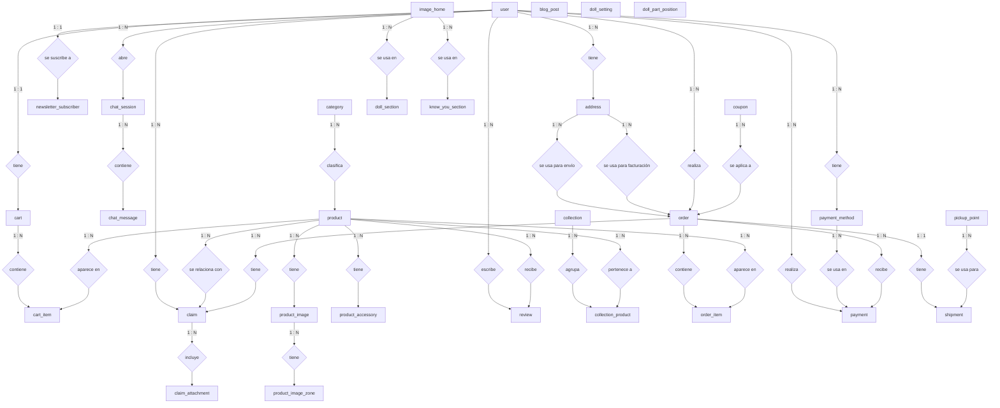

# MiKiwi Entity-Relationship Model

Este archivo es el modelo entidad-relación conceptual:
- entidades/tablas
- relaciones entre ellas
- cardinalidades

Sin columnas, sin IDs y sin claves foráneas.
