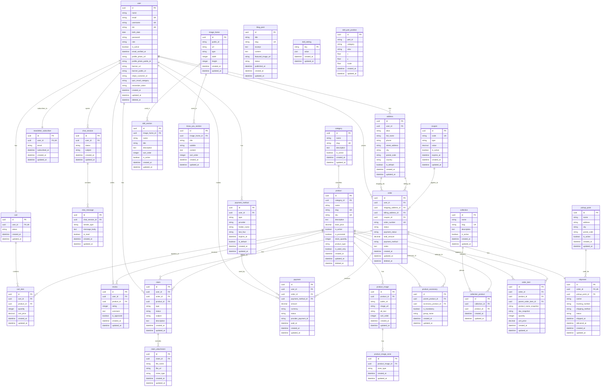

# MiKiwi Relational Model

```mermaid
erDiagram
    user {
        uuid id PK
        string name
        string email UK
        string username UK
        string dni UK
        date birth_date
        string password
        string role
        boolean is_active
        datetime email_verified_at
        string profile_photo_url
        string profile_photo_public_id
        string banner_url
        string banner_public_id
        string stripe_customer_id
        string quiz_result_category
        string remember_token
        datetime created_at
        datetime updated_at
        datetime deleted_at
    }

    address {
        uuid id PK
        uuid user_id FK
        string alias
        string full_name
        string phone
        string street_address
        string city
        string postal_code
        string country
        boolean is_default
        datetime created_at
        datetime updated_at
    }

    newsletter_subscriber {
        uuid id PK
        uuid user_id FK,UK
        string email
        datetime subscribed_at
        datetime created_at
        datetime updated_at
    }

    cart {
        uuid id PK
        uuid user_id FK,UK
        string status
        datetime created_at
        datetime updated_at
    }

    cart_item {
        uuid id PK
        uuid cart_id FK
        uuid product_id FK
        integer quantity
        decimal unit_price
        datetime created_at
        datetime updated_at
    }

    chat_session {
        uuid id PK
        uuid user_id FK
        string status
        string subject
        datetime created_at
        datetime updated_at
    }

    chat_message {
        uuid id PK
        uuid chat_session_id FK
        string sender_type
        text message_body
        boolean is_read
        datetime created_at
        datetime updated_at
    }

    review {
        uuid id PK
        uuid user_id FK
        uuid product_id FK
        integer rating
        text comment
        boolean is_approved
        datetime created_at
        datetime updated_at
    }

    claim {
        uuid id PK
        uuid user_id FK
        uuid order_id FK
        uuid product_id FK
        string type
        string status
        string subject
        text description
        datetime created_at
        datetime updated_at
    }

    claim_attachment {
        uuid id PK
        uuid claim_id FK
        string file_name
        string file_url
        string mime_type
        datetime created_at
        datetime updated_at
    }

    payment_method {
        uuid id PK
        uuid user_id FK
        string type
        string provider
        string holder_name
        string last_four
        datetime expires_at
        boolean is_default
        datetime created_at
        datetime updated_at
    }

    payment {
        uuid id PK
        uuid user_id FK
        uuid order_id FK
        uuid payment_method_id FK
        decimal amount
        string currency
        string status
        string provider_payment_id
        datetime paid_at
        datetime created_at
        datetime updated_at
    }

    category {
        uuid id PK
        string name
        string slug UK
        text description
        boolean is_active
        datetime created_at
        datetime updated_at
    }

    collection {
        uuid id PK
        string name
        string slug UK
        text description
        boolean is_active
        datetime created_at
        datetime updated_at
    }

    product {
        uuid id PK
        uuid category_id FK
        string name
        string slug UK
        string sku UK
        text description
        decimal base_price
        boolean is_active
        boolean is_promoted
        integer stock_quantity
        string product_type
        boolean is_adult_only
        datetime created_at
        datetime updated_at
        datetime deleted_at
    }

    product_image {
        uuid id PK
        uuid product_id FK
        string public_id
        string image_url
        string alt_text
        integer sort_order
        datetime created_at
        datetime updated_at
    }

    product_image_zone {
        uuid id PK
        uuid product_image_id FK
        string zone_type
        datetime created_at
        datetime updated_at
    }

    product_accessory {
        uuid id PK
        uuid parent_product_id FK
        uuid accessory_product_id FK
        boolean is_mandatory
        string group_name
        datetime created_at
        datetime updated_at
    }

    collection_product {
        uuid id PK
        uuid collection_id FK
        uuid product_id FK
        datetime created_at
        datetime updated_at
    }

    order {
        uuid id PK
        uuid user_id FK
        uuid shipping_address_id FK
        uuid billing_address_id FK
        uuid coupon_id FK
        string order_number UK
        string status
        string payment_status
        decimal total_amount
        string payment_method
        text notes
        datetime created_at
        datetime updated_at
        datetime deleted_at
    }

    order_item {
        uuid id PK
        uuid order_id FK
        uuid product_id FK
        uuid parent_order_item_id FK
        string product_name_snapshot
        string sku_snapshot
        integer quantity
        decimal unit_price
        datetime created_at
        datetime updated_at
    }

    coupon {
        uuid id PK
        string code UK
        string type
        decimal value
        boolean is_active
        datetime expires_at
        datetime created_at
        datetime updated_at
    }

    shipment {
        uuid id PK
        uuid order_id FK,UK
        uuid pickup_point_id FK
        string carrier
        string tracking_number
        string shipping_method
        string status
        datetime shipped_at
        datetime delivered_at
        datetime created_at
        datetime updated_at
    }

    pickup_point {
        uuid id PK
        string name
        string address
        string city
        string postal_code
        boolean is_active
        datetime created_at
        datetime updated_at
    }

    image_home {
        uuid id PK
        string public_id
        string url
        string type
        integer width
        integer height
        datetime created_at
        datetime updated_at
    }

    doll_section {
        uuid id PK
        uuid image_home_id FK
        string name
        string title
        text description
        integer sort_order
        boolean is_active
        datetime created_at
        datetime updated_at
    }

    know_you_section {
        uuid id PK
        uuid image_home_id FK
        string title
        string subtitle
        text content
        integer sort_order
        datetime created_at
        datetime updated_at
    }

    blog_post {
        uuid id PK
        string title
        string slug UK
        text excerpt
        text content
        string featured_image_url
        string status
        datetime published_at
        datetime created_at
        datetime updated_at
    }

    doll_setting {
        string key PK
        json value
        datetime created_at
        datetime updated_at
    }

    doll_part_position {
        uuid id PK
        string part_id
        string category
        string view
        float x
        float y
        float scale
        datetime created_at
        datetime updated_at
    }

    user ||--o{ address : has
    user ||--|| newsletter_subscriber : subscribes_to
    user ||--|| cart : has
    cart ||--o{ cart_item : contains
    product ||--o{ cart_item : appears_in

    user ||--o{ order : places
    address ||--o{ order : shipping_for
    address ||--o{ order : billing_for
    coupon ||--o{ order : applies_to
    order ||--o{ order_item : contains
    product ||--o{ order_item : appears_in
    order ||--|| shipment : has
    pickup_point ||--o{ shipment : used_for

    user ||--o{ review : writes
    product ||--o{ review : receives

    user ||--o{ chat_session : opens
    chat_session ||--o{ chat_message : contains

    user ||--o{ claim : has
    order ||--o{ claim : has
    product ||--o{ claim : relates_to
    claim ||--o{ claim_attachment : includes

    user ||--o{ payment_method : has
    user ||--o{ payment : makes
    payment_method ||--o{ payment : used_by
    order ||--o{ payment : receives

    category ||--o{ product : classifies
    product ||--o{ product_image : has
    product_image ||--o{ product_image_zone : has
    product ||--o{ product_accessory : parent_of
    product ||--o{ product_accessory : accessory_of

    collection ||--o{ collection_product : groups
    product ||--o{ collection_product : belongs_to

    image_home ||--o{ doll_section : used_in
    image_home ||--o{ know_you_section : used_in
```
