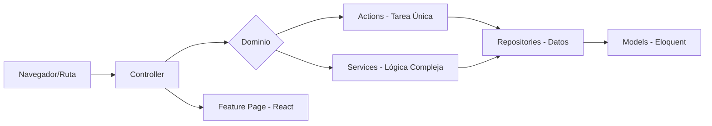

# Arquitectura y Estructura del Proyecto (MiKiwi)

Este documento sirve como referencia maestra para entender la organización actual del proyecto tras el gran refactor de la rama `Refactor/RefactorizarProyecto/1.0`. El objetivo principal fue transicionar hacia una arquitectura **modular (features)** en el frontend y **orientada al dominio (DDD-light)** en el backend.

---

## 1. Visión General (The Big Picture)

El flujo de información sigue un camino predecible para garantizar que cada pieza de código tenga una responsabilidad única y sea fácil de testear.

### Flujo de Ejecución Típico



**Filosofía**: _"Escalabilidad sin fricción"_. Separamos lo que cambia (UI/Features) de lo que permanece (Dominio/Lógica de Negocio).

---

## 2. Arquitectura Frontend (Features & Shared)

El frontend vive íntegramente en `resources/js/`. Hemos abandonado la estructura plana por una basada en capacidades de negocio.

### Mapa de Directorios

- `resources/js/Features/`: El corazón de la aplicación. Módulos independientes.
- `resources/js/Shared/`: Componentes UI atómicos, hooks globales, traducciones y utilidades.
- `resources/js/Layouts/`: Envoltorios globales (Autenticado, Invitado, Configurador).

### Anatomía de una Feature (`Features/<Modulo>/`)

| Carpeta       | Propósito                                                  | Ejemplos Reales                                              |
| :------------ | :--------------------------------------------------------- | :----------------------------------------------------------- |
| `Pages/`      | Componentes principales que reciben datos de Inertia.      | `Catalog/Pages/Products`, `Auth/Pages/Login`                 |
| `Components/` | Sub-componentes específicos de esa feature.                | `Checkout/Components/OrderSummary`, `Home/Components/Slider` |
| `Hooks/`      | Lógica de estado o efectos reutilizable solo en el módulo. | `Auth/Hooks/useAuth`, `Configurator/Hooks/useDoll`           |
| `Api/`        | Funciones para llamadas a endpoints específicos.           | `Catalog/Api/index.js`, `Checkout/Api/stripe.js`             |
| `Utils/`      | Helpers lógicos dedicados exclusivamente al módulo.        | `Configurator/Utils/3dHelpers.js`                            |

**Regla de Oro (CSS)**: Cada componente importante vive en su carpeta con su CSS local:

```text
Componente/
├── Componente.jsx
└── Componente.css  <-- Se importa dentro del .jsx
```

---

## 3. Arquitectura Backend (DDD-Light)

Hemos movido la lógica de negocio desde los controladores hacia `app/Domain/`, dejando el `app/Http/Controllers` como una capa delgada de orquestación.

### Diccionario de Responsabilidades

| Capa             | Responsabilidad                                          | Ejemplos Reales del Proyecto                           |
| :--------------- | :------------------------------------------------------- | :----------------------------------------------------- |
| **Actions**      | Tareas atómicas de escritura o procesos únicos.          | `CreateOrder`, `CancelOrder`, `SetDefaultAddress`      |
| **Services**     | Procesos de varias etapas o integración con terceros.    | `StripeService`, `CloudinaryService`, `CartService`    |
| **Repositories** | La única puerta de acceso a la base de datos (Eloquent). | `EloquentProductRepository`, `EloquentOrderRepository` |
| **Models**       | Definición del esquema y relaciones Eloquent.            | `Product.php`, `Category.php`, `User.php`              |

_Nota: Los modelos permanecen en `app/Models` para compatibilidad con Laravel, pero solo contienen esquemas y relaciones, no lógica de negocio pesada._

### ¿Dónde queda la lógica? (Modelos vs Dominio)

Una de las reglas más estrictas de esta nueva arquitectura es evitar los **"Fat Models"** (modelos obesos).

- **El Modelo (`app/Models`) es el "Recipiente"**: Solo debe conocer la estructura de la base de datos, las relaciones y las propiedades de Laravel (como `$fillable`). **No debe contener lógica de negocio.**
- **El Dominio (`app/Domain`) es el "Cerebro"**: Aquí es donde reside la inteligencia. Si hay un cálculo de impuestos, un proceso de validación complejo o una integración, vive aquí.

> [!IMPORTANT]
> Si te encuentras escribiendo un método complejo dentro de un archivo en `app/Models`, detente. Probablemente deba ser un **Action** o un **Service** en el **Dominio**.

---

## 4. Guía Práctica: "Quiero añadir una funcionalidad"

Para mantener la armonía, sigue este checklist:

1.  **Backend**:
    - [ ] Definir el Service o Action en `app/Domain/<NombreDominio>/`.
    - [ ] (Si aplica) Crear/Ajustar el Repository.
    - [ ] Crear el Controller (delgado) que llame al Service/Action.
2.  **Frontend**:
    - [ ] Crear la página en `resources/js/Features/<NombreFeature>/Pages/`.
    - [ ] Desarrollar componentes en `../Components/`.
    - [ ] Usar alias `@/Features/...` para imports.
3.  **Rutas**:
    - [ ] Registrar la ruta en `routes/web.php` usando `Inertia::render('Feature/Pages/Vista')`.

---

## 5. Reglas de Oro e Infraestructura

### Aliases de Importación

Usa siempre el alias `@/` que apunta a `resources/js/`.

- **Mal**: `import Button from '../../../Shared/Components/Button'`
- **Bien**: `import Button from '@/Shared/Components/Button'`

### Inertia Resolver

El sistema está configurado para buscar automáticamente las páginas dentro del patrón `Features/**/Pages`. Esto fuerza la organización y evita el caos de carpetas desordenadas.

### CI/CD (GitHub Actions)

Cada cambio es validado por un pipeline de Integración Continua que:

1. Instala dependencias (Composer/NPM).
2. Construye el frontend (Vite).
3. Ejecuta los tests de PHPUnit (`.env.testing`).

---

## 6. Glosario de Legacy (Cementerio)

- `resources/js/Pages/`: **NO TOCAR**. Es la carpeta antigua. Todo lo nuevo va a `Features/`.
- `resources/js/Components/`: **LEGACY**. Usar `Shared/` para globales o el `Components/` interno de cada feature.

---

---

## 7. Escenarios Reales: "¿Dónde meto mi código?"

Imagina que soy yo el que tiene que programar una funcionalidad nueva. Vamos a ver dónde metería cada cosa y por qué con el ejemplo del **Carrito de Compra**.

### Caso: "Quero añadir la lógica para agregar un producto al carrito"

#### 1. ¿Dónde vive la "inteligencia"? (Backend - Dominio)

Lo primero que pienso es: _"¿Esto es una acción única?"_. Sí, "Añadir al Carrito" es una acción atómica.

- **Lo meto en**: `app/Domain/Carts/Actions/AddToCart.php`.
- **¿Por qué?**: Porque si mañana quiero añadir productos desde la web, desde una App móvil o desde un proceso automático, solo tengo que llamar a esta clase. El modelo `Cart` no debería saber cómo validarse a sí mismo, solo guarda datos.

#### 2. ¿Quién orquesta el tráfico? (Backend - Controller)

Ahora necesito que el navegador pueda hablar con esa acción.

- **Lo meto en**: `app/Http/Controllers/CartController.php`.
- **¿Qué hace?**: Recibe el `id` del producto del frontend, llama al `AddToCart` Action, y cuando este termina, me devuelve a la página del carrito. El controlador es un **mensajero**, no sabe de lógica.

#### 3. ¿Dónde guardo los datos? (Backend - Repository)

Si mi acción necesita saber si hay stock antes de añadir al carrito:

- **Lo meto en**: `app/Domain/Products/Repositories/EloquentProductRepository.php`.
- **¿Por qué?**: Porque el Action no debería tirar de `Product::where(...)` directamente. Si el día de mañana cambiamos la base de datos a algo que no sea Eloquent, solo toco el Repository y el resto del sistema ni se entera.

#### 4. ¿Y qué pasa en la pantalla? (Frontend - Feature)

Ahora me voy a la parte visual. Como el "Carrito" es una funcionalidad grande, tiene su propio espacio.

- **La página completa**: `resources/js/Features/Checkout/Pages/Cart.jsx`.
- **El botón de "Añadir"**: `resources/js/Features/Catalog/Components/AddToCartButton/`.
- **¿Por qué?**: El botón está en el Catálogo, pero la acción afecta al Checkout. Uso el alias `@/Features/Checkout/Api` para llamar al backend desde el botón.

#### 5. ¿Y los estilos?

- **Lo meto en**: `AddToCartButton.css` dentro de la carpeta del componente.
- **¿Por qué?**: Si el día de mañana borro el botón, sé exactamente qué CSS puedo borrar sin miedo a romper el resto de la web.

### Caso: "Quiero aplicar un cupón de descuento"

#### 1. ¿Dónde vive la lógica? (Backend - Dominio)

Aquí la cosa es más compleja que un simple guardado. Hay que validar si el cupón existe, si ha caducado, si el carrito llega al mínimo...

- **Lo meto en**: `app/Domain/Coupons/Services/CouponService.php`.
- **¿Por qué?**: Uso un **Service** en lugar de un Action porque la lógica de cupones suele ser un "conjunto de reglas" más que una sola tarea. El Service puede tener un método `apply(Coupon $coupon, Cart $cart)`.

#### 2. ¿Cómo se comunican las piezas?

El `CouponService` probablemente necesite hablar con el `CartService` para recalcular el total. Como ambos están en `app/Domain`, la comunicación es limpia y directa entre services.

#### 3. ¿Y en el Frontend?

- **Componente**: `resources/js/Features/Checkout/Components/CouponForm/`.
- **CSS**: `CouponForm.css` en la misma carpeta.
- **¿Por qué?**: Porque el formulario de cupones es exclusivo del proceso de pago. No lo quiero "flotando" en una carpeta genérica de componentes donde se perdería.

---

> [!TIP]
> **Regla de oro de mi "yo" programador:** Si una función tiene más de 10 líneas en un Controlador o un Modelo, probablemente se ha escapado de su sitio y debería estar en un **Action** o un **Service**.
