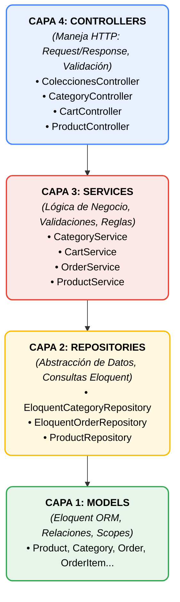

<a href="README.md"></a>

# Guía de Arquitectura y Controladores

## 📋 Resumen de Implementación

Este documento explica los **controladores backend** creados siguiendo la arquitectura de 4 capas definida en [ROADMAP_BACKEND.md](./ROADMAP_BACKEND.md).

### ✅ Estado Actual: COMPLETADO

Se han implementado **12 archivos nuevos** siguiendo el patrón **Repository → Service → Controller**:

- ✅ 4 Repositories (2 interfaces + 2 implementaciones)
- ✅ 3 Services con lógica de negocio
- ✅ 3 Controllers nuevos
- ✅ 1 Controller actualizado (ProductController)
- ✅ Configuración de inyección de dependencias

---

## 🏗️ Arquitectura Implementada



---

## 📂 Estructura de Archivos Creados

### 1️⃣ Repositories (Capa de Persistencia)

#### Interfaces
```
app/Repositories/Interfaces/
├── CategoryRepositoryInterface.php  ← Define contrato para categorías
└── OrderRepositoryInterface.php     ← Define contrato para pedidos
```

#### Implementaciones
```
app/Repositories/Eloquent/
├── EloquentCategoryRepository.php   ← Consultas de categorías con Eloquent
└── EloquentOrderRepository.php      ← Consultas de pedidos con transacciones
```

### 2️⃣ Services (Capa de Negocio)

```
app/Services/
├── CategoryService.php              ← Lógica de categorías + breadcrumbs
├── CartService.php                  ← Gestión del carrito (sesión)
└── OrderService.php                 ← Creación y gestión de pedidos
```

### 3️⃣ Controllers (Capa de Presentación)

```
app/Http/Controllers/
├── ColeccionesController.php        ← Catálogo principal
├── CategoryController.php           ← Vista de categoría
├── CartController.php               ← Carrito de compras (CRUD)
└── ProductController.php            ← Actualizado para usar ProductService
```

### 4️⃣ Configuración

```
app/Providers/
└── AppServiceProvider.php           ← Bindings de inyección de dependencias
```

---

## 🔌 Endpoints Disponibles

### Catálogo y Productos

| Método | Ruta | Controller | Descripción |
|--------|------|------------|-------------|
| `GET` | `/colecciones` | `ColeccionesController@index` | Catálogo principal paginado |
| `GET` | `/producto/{product}` | `ProductController@show` | Detalles de producto + accesorios |
| `GET` | `/categoria/{category}` | `CategoryController@show` | Productos por categoría |

### Carrito de Compras

| Método | Ruta | Controller | Descripción |
|--------|------|------------|-------------|
| `GET` | `/cart` | `CartController@index` | Ver carrito |
| `POST` | `/cart/add` | `CartController@store` | Agregar producto |
| `PUT` | `/cart/update/{id}` | `CartController@update` | Actualizar cantidad |
| `DELETE` | `/cart/remove/{id}` | `CartController@destroy` | Eliminar producto |
| `POST` | `/cart/clear` | `CartController@clear` | Vaciar carrito |

> **Nota**: Las rutas del carrito ya están definidas en `routes/web.php` pero puedes agregar más si es necesario.

---

## 🎨 Características Implementadas

### ✅ Carrito de Compras (Session-Based)
- **Almacenamiento**: Sesión de Laravel (no requiere login)
- **Validación de stock**: En tiempo real antes de agregar/actualizar
- **Soporte para accesorios**: Productos configurables
- **Cálculo automático**: Subtotales y total

### ✅ Sistema de Pedidos
- **Números únicos**: Formato `MK-YYYYMMDD-XXXXXX`
- **Snapshots**: Guarda estado del producto al momento de compra
- **Transacciones DB**: Integridad garantizada
- **Direcciones**: Snapshots de envío y facturación en JSON

### ✅ Categorías Jerárquicas
- **Navegación multinivel**: Padre → Hijo
- **Breadcrumbs automáticos**: Generados por CategoryService
- **Productos filtrados**: Solo activos y con stock

### ✅ Optimización de Consultas
- **Eager Loading**: `with()` para evitar N+1 queries
- **Paginación**: Automática en listados
- **Scopes**: Reutilización de filtros (`active()`, `inStock()`)

---

## 🚀 Siguientes Pasos

### 📌 PASO 1: Crear Vistas Frontend (React/Inertia)

Los controladores están listos pero necesitan las vistas correspondientes:

#### Vistas a Crear:

```
resources/js/Pages/
├── Colecciones/
│   └── Index.jsx                    ← Catálogo principal
├── Category/
│   └── Show.jsx                     ← Vista de categoría
└── Cart/
    └── Index.jsx                    ← Carrito de compras
```

#### Ejemplo de Vista: `Colecciones/Index.jsx`

```jsx
import { Head } from '@inertiajs/react';

export default function Index({ products, categories, pageTitle }) {
    return (
        <>
            <Head title={pageTitle} />
            
            <div className="container">
                <h1>Catálogo de Productos</h1>
                
                {/* Navegación de categorías */}
                <nav>
                    {categories.map(category => (
                        <a key={category.id} href={`/categoria/${category.slug}`}>
                            {category.name}
                        </a>
                    ))}
                </nav>
                
                {/* Grid de productos */}
                <div className="products-grid">
                    {products.data.map(product => (
                        <div key={product.id} className="product-card">
                            <h3>{product.name}</h3>
                            <p>{product.base_price}€</p>
                            <a href={`/producto/${product.slug}`}>Ver detalles</a>
                        </div>
                    ))}
                </div>
                
                {/* Paginación */}
                <div className="pagination">
                    {/* Usar products.links para paginación */}
                </div>
            </div>
        </>
    );
}
```

---

### 📌 PASO 2: Actualizar Rutas (Opcional)

Si necesitas más rutas para el carrito, agrégalas en `routes/web.php`:

```php
// Rutas adicionales del carrito
Route::prefix('cart')->group(function () {
    Route::get('/', [CartController::class, 'index'])->name('cart.index');
    Route::post('/add', [CartController::class, 'store'])->name('cart.add');
    Route::put('/update/{id}', [CartController::class, 'update'])->name('cart.update');
    Route::delete('/remove/{id}', [CartController::class, 'destroy'])->name('cart.remove');
    Route::post('/clear', [CartController::class, 'clear'])->name('cart.clear');
});
```

---

### 📌 PASO 3: Crear OrderController (Para Checkout)

Cuando estés listo para implementar el proceso de compra:

```php
<?php

namespace App\Http\Controllers;

use App\Services\OrderService;
use Illuminate\Http\Request;
use Inertia\Inertia;

class OrderController extends Controller
{
    protected $orderService;

    public function __construct(OrderService $orderService)
    {
        $this->orderService = $orderService;
    }

    /**
     * Mostrar formulario de checkout
     */
    public function create()
    {
        return Inertia::render('Checkout/Create');
    }

    /**
     * Crear pedido desde el carrito
     */
    public function store(Request $request)
    {
        $validated = $request->validate([
            'shipping_address' => 'required|array',
            'billing_address' => 'nullable|array',
            'payment_method' => 'required|string'
        ]);

        try {
            $order = $this->orderService->createOrderFromCart(
                auth()->id(),
                $validated['shipping_address'],
                $validated['billing_address'] ?? null,
                $validated['payment_method']
            );

            return redirect()
                ->route('order.success', $order['order_number'])
                ->with('success', 'Pedido creado exitosamente');
                
        } catch (\Exception $e) {
            return back()->withErrors(['error' => $e->getMessage()]);
        }
    }

    /**
     * Mostrar confirmación de pedido
     */
    public function success(string $orderNumber)
    {
        $orderDetails = $this->orderService->getOrderDetails($orderNumber);
        
        return Inertia::render('Order/Success', [
            'order' => $orderDetails['order']
        ]);
    }
}
```

---

### 📌 PASO 4: Implementar Funcionalidad AJAX del Carrito

Para agregar productos sin recargar la página:

```javascript
// Ejemplo con fetch API
async function addToCart(productSlug, quantity = 1) {
    try {
        const response = await fetch('/cart/add', {
            method: 'POST',
            headers: {
                'Content-Type': 'application/json',
                'X-CSRF-TOKEN': document.querySelector('meta[name="csrf-token"]').content
            },
            body: JSON.stringify({
                product_slug: productSlug,
                quantity: quantity,
                accessories: [] // Si aplica
            })
        });

        const data = await response.json();
        
        if (data.success) {
            // Actualizar contador del carrito
            updateCartCount(data.cart.item_count);
            alert('Producto agregado al carrito');
        } else {
            alert(data.message);
        }
    } catch (error) {
        console.error('Error:', error);
    }
}
```

---

### 📌 PASO 5: Testing (Recomendado)

Crear tests para validar la lógica:

```bash
# Crear test para CartService
php artisan make:test CartServiceTest --unit

# Crear test para OrderController
php artisan make:test OrderControllerTest
```

Ejemplo de test:

```php
public function test_can_add_product_to_cart()
{
    $product = Product::factory()->create([
        'stock_quantity' => 10,
        'is_active' => true
    ]);

    $cart = $this->cartService->addToCart($product->slug, 2);

    $this->assertEquals(2, $cart['item_count']);
    $this->assertNotEmpty($cart['items']);
}
```

---

## 🔧 Comandos Útiles

```bash
# Limpiar caché de configuración
php artisan config:clear

# Regenerar autoload de clases
composer dump-autoload

# Ver todas las rutas disponibles
php artisan route:list

# Limpiar sesiones (si hay problemas con el carrito)
php artisan session:clear

# Ejecutar migraciones
php artisan migrate

# Poblar base de datos
php artisan db:seed
```

---

## 📊 Flujo de Datos: Ejemplo de Agregar al Carrito

```
1. Usuario hace clic en "Agregar al Carrito"
   ↓
2. Frontend envía POST a /cart/add
   ↓
3. CartController::store() recibe la petición
   ↓
4. CartController valida los datos (Request Validation)
   ↓
5. CartController llama a CartService::addToCart()
   ↓
6. CartService valida stock usando ProductRepository
   ↓
7. CartService agrega producto a la sesión
   ↓
8. CartService retorna datos del carrito actualizado
   ↓
9. CartController retorna JSON response
   ↓
10. Frontend actualiza UI (contador, notificación)
```

---

## 🐛 Troubleshooting

### Error: "Class not found"
```bash
composer dump-autoload
```

### Error: "Target class [CategoryRepositoryInterface] does not exist"
Verifica que `AppServiceProvider.php` tenga los bindings correctos.

### Carrito no persiste entre páginas
Verifica que las sesiones estén configuradas correctamente en `.env`:
```env
SESSION_DRIVER=file
SESSION_LIFETIME=120
```

### Stock no se valida
Asegúrate de que los productos tengan `stock_quantity > 0` y `is_active = true`.

---

## 📚 Documentación Adicional

- [ROADMAP_BACKEND.md](./ROADMAP_BACKEND.md) - Arquitectura del proyecto
- [README_BACKEND.md](./README_BACKEND.md) - Estado del backend
- [PilaresProyecto.md](./PilaresProyecto.md) - Estándares del proyecto

---

## 👥 Para el Equipo

### ✅ Backend (Completado)
- Todos los controladores están creados
- Arquitectura de 4 capas implementada
- Inyección de dependencias configurada

### 🎨 Frontend (Pendiente)
- Crear vistas React/Inertia
- Implementar llamadas AJAX al carrito
- Diseñar UI del checkout

### 🧪 Testing (Recomendado)
- Tests unitarios para Services
- Tests de integración para Controllers
- Tests E2E para flujo de compra

---

## 📞 Contacto

Si tienes dudas sobre la implementación, revisa:
1. Los comentarios en el código
2. El archivo `walkthrough.md` en `.gemini/antigravity/brain/`
3. La documentación de Laravel: https://laravel.com/docs

---

**Estado**: ✅ Backend completado - Listo para integración con Frontend

**Última actualización**: Mayo 2026
 
