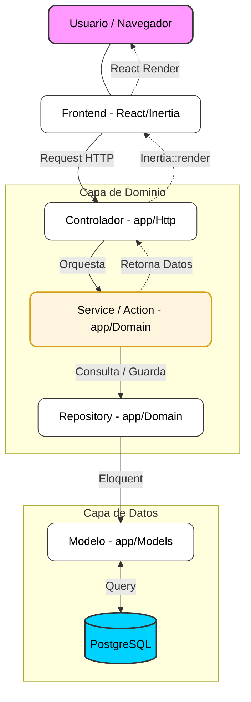

# Arquitectura del Sistema

MiKiwi sigue una arquitectura de capas limpia, facilitando el mantenimiento y la escalabilidad del dominio de negocio.

## Flujo de Información (4 Capas)

El sistema está diseñado siguiendo una arquitectura de capas que separa las responsabilidades de transporte, lógica de negocio y persistencia.

1.  **Controladores**: Finos, encargados solo de recibir el request y devolver la respuesta (Inertia o JSON).
2.  **Servicios/Actions**: Contienen la lógica de negocio pura y reglas de dominio.
3.  **Repositorios**: Abstraen el acceso a datos para que el dominio no dependa de Eloquent directamente.
4.  **Modelos**: Definen el esquema, relaciones, casts y scopes de la base de datos.

## Estructura de Directorios

### Frontend (`resources/js/`)
*   `Pages/`: Componentes de página renderizados por Inertia.
*   `Components/`: Componentes React reutilizables (globales o por área).
*   `Hooks/`: Lógica de estado compartida.
*   `Utils/`: Funciones de utilidad pura.
*   `Layouts/`: Contenedores de composición de interfaz.

### Backend (`app/`)
*   `Domain/`: El corazón del negocio (Services, Actions, Repositories).
*   `Http/`: Controladores, Requests y Middlewares.
*   `Models/`: Modelos Eloquent.
*   `Providers/`: Registro de servicios e inyección de dependencias.

---
*Última actualización: Mayo 2026*

